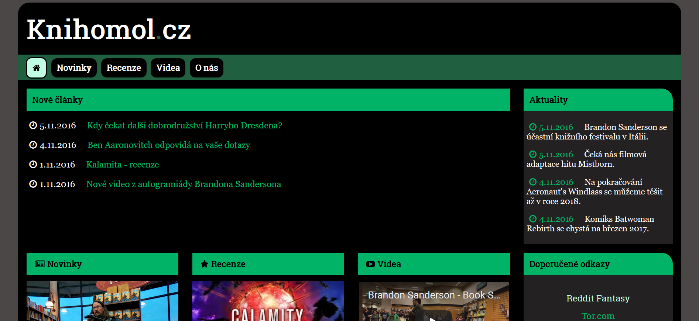
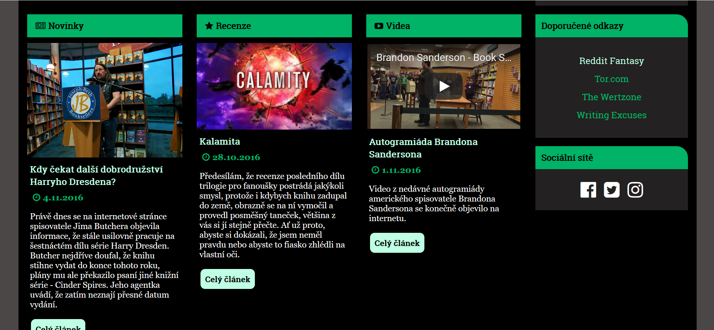

# Tvorba statických stránek

Projekt ze zimního semestru 2016/17. Cílem bylo vytvořit web smysluplného vzhledu i obsahu, bez použití jakýchkoli frameworků. [Zde](http://4iz268.github.io/zakonceni/stranky/) jsou požadavky upřesněny podrobněji. Web je responzivní.

